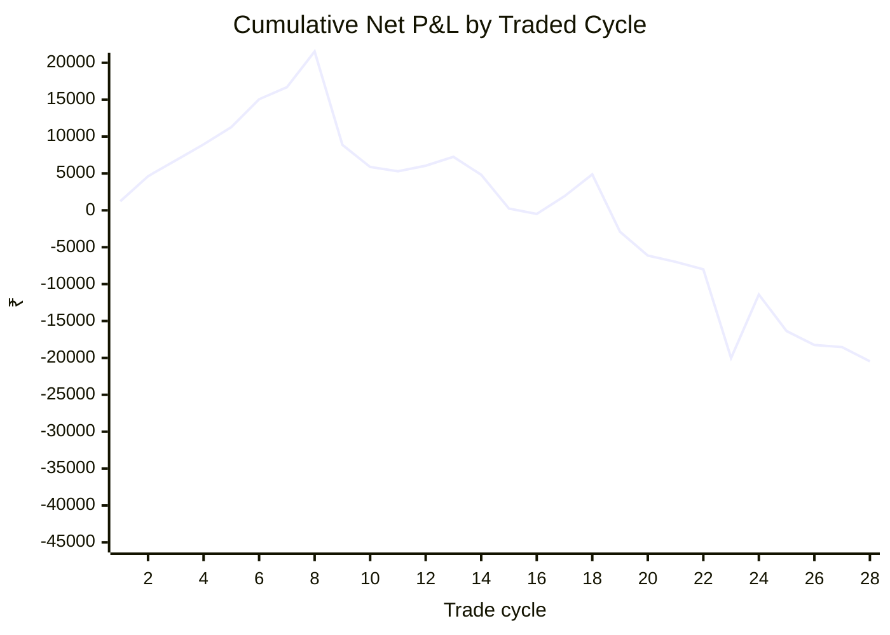
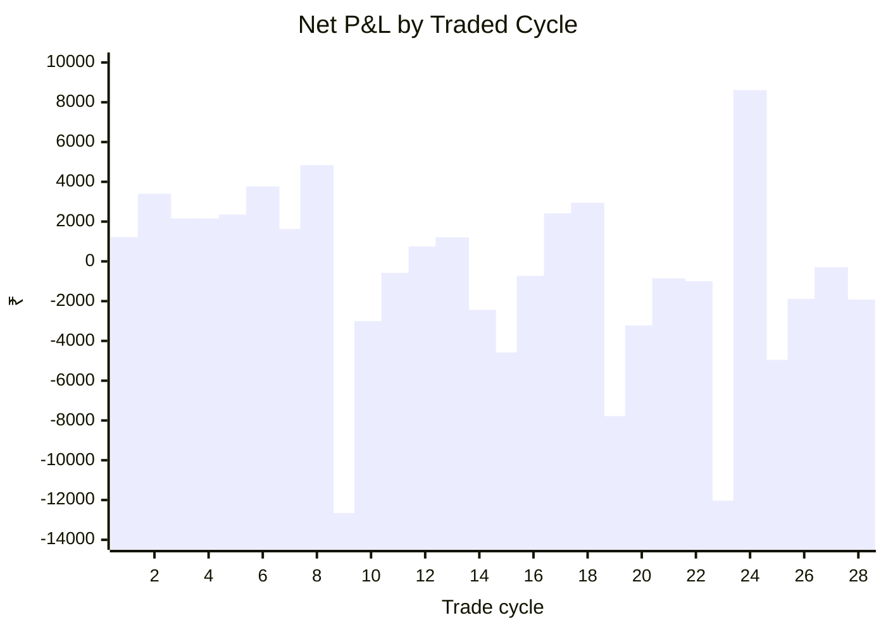

# Final Research Manuscript
## Iron Condor → Directional Ratio Spread v2: Research-Use Evaluation of the User-Defined NIFTY Strategy

**Research date:** 5 October 2026  
**Developer branch:** `phase-3-robustness-developer`  
**Tester branch:** `phase-3-robustness-tester`  
**Verified workflow:** 37237347768  
**Verified code commit:** `9adf6381039f2e627c58c2762116018086e2d006`  
**Tester review:** `research/PHASE_3_TESTER_REVIEW_29.md`

---

## Abstract

This study evaluates the exact NIFTY monthly options strategy supplied by the user from the referenced YouTube strategy: a 0.30/0.10-delta monthly iron condor that transitions to a directional 1:-2:+1 ratio spread when either iron-condor short leg reaches approximately 0.10 absolute delta; the ratio position is rebuilt in the same direction when the combined absolute delta of its two short legs reaches approximately 0.20; and the ratio position reverses direction when the relevant short-leg delta reaches a fixed 1.30. No return to the iron condor is permitted after transition.

The study uses a provenance-aware composite of free/public NIFTY option data and a separate research-use partial-data mode because strict full lifecycle coverage was unavailable. No missing option prices were interpolated, forward-filled, averaged, or theoretically reconstructed. Execution is causal, with completed-bar signals and next common executable observations, and every order includes the configured brokerage and slippage model.

The verified research-use sample contains 28 traded expiry cycles. Net P&L was **−₹20,455.46** on a ₹1,00,000 reference capital, profit factor **0.6468**, win rate **46.43%**, maximum drawdown **−₹41,981.20**, and annualized monthly Sharpe proxy **−0.5414**. Gross P&L before transaction costs was already negative at **−₹3,821.50**; transaction costs added **₹16,633.96**, producing the final net loss. The strict lifecycle gate remains **0/69 requested calendar months complete**.

The independent tester reproduced the reported metrics exactly from the compact trade-level and order-level outputs. No 1.30 reversal event occurred in the 28 traded cycles; 38 same-direction continuation resets occurred. The study therefore finds **no evidence of a positive trading edge under the tested configuration** and does **not** promote the strategy for trading. The result is exploratory because of the partial-data availability bias and should not be conflated with a fully covered historical validation.

---

## 1. Background and motivation

An iron condor combines a short call spread and short put spread and is generally used for range-bound or relatively low-volatility conditions. Ratio spreads create asymmetric exposure because more options are sold than bought; their payoff is highly dependent on direction, implied-volatility skew and tail behaviour. These structural properties motivate evaluating not only average return but also drawdown, tail losses, cost drag and state-transition behaviour.

Indian option-market research further motivates attention to implied volatility, skew, volatility-risk-premium effects, FII positioning and changes in derivatives-market structure. The literature review for this project records evidence that implied volatility has information about future volatility, that volatility-risk-premium effects are present in Indian option markets, and that the introduction and evolution of weekly index options changed information absorption and market structure.

The study therefore treats those dimensions as explanatory research variables for future work rather than as new trading rules.

---

## 2. Research questions

### Primary question

Does the user-defined monthly NIFTY 0.30/0.10-delta iron-condor strategy, converted causally into the specified directional ratio structure and managed by the specified continuation and fixed-1.30 reversal rules, produce robust risk-adjusted returns after realistic Indian option-trading costs and slippage?

### Secondary questions

1. How often does the initial iron condor transition?
2. How frequently does the ratio position reset in the same direction?
3. How often is the fixed 1.30 reversal rule actually triggered?
4. How much gross performance is lost to brokerage, statutory charges and slippage?
5. What are the cycle-level tail-loss and drawdown characteristics?
6. How much confidence can be placed in the result when the underlying option-history coverage is incomplete?

---

## 3. Hypotheses

**H1.** The dynamic transition strategy improves risk-adjusted returns relative to a static iron condor after costs.

**H2.** Transition outcomes vary by market-volatility regime.

**H3.** Transition profitability and tail risk depend on implied-volatility skew.

**H4.** Transaction costs consume a meaningful fraction of gross strategy performance.

**H5.** A credible strategy conclusion requires reasonable temporal and data-availability stability.

Only H4 and the descriptive portions of H1/H5 can be meaningfully addressed by the current research-use run. The static-iron-condor benchmark and ex-ante regime covariates were not available at sufficient quality for a defensible comparative inference.

---

## 4. Exact strategy specification

### 4.1 Initial monthly iron condor

For each eligible NIFTY monthly expiry:

- Sell 1 × 0.30-delta call.
- Buy 1 × 0.10-delta call hedge.
- Sell 1 × 0.30-delta put.
- Buy 1 × 0.10-delta put hedge.

### 4.2 Transition

Only the two short iron-condor legs are monitored.

When either short leg reaches approximately 0.10 absolute delta:

- exit the full iron condor;
- use the breakout side to choose the directional ratio;
- do not return to the iron condor within that cycle.

### 4.3 Falling-market ratio

Call ratio:

- Buy 1 × 0.50-delta call.
- Sell 2 × 0.40-delta calls.
- Buy 1 × 0.10-delta call hedge.

### 4.4 Rising-market ratio

Put ratio:

- Buy 1 × 0.50-delta put.
- Sell 2 × 0.40-delta puts.
- Buy 1 × 0.10-delta put hedge.

### 4.5 Continuation reset

When the combined absolute delta of the two short ratio legs reaches approximately 0.20:

- exit the current ratio;
- rebuild in the same direction at:
  - +1 × 0.40 delta;
  - −2 × 0.30 delta;
  - +1 × 0.08 delta hedge.

### 4.6 Reversal

When the relevant short-leg delta reaches **1.30**:

- exit the current ratio;
- reverse direction;
- build the opposite initial 0.50/0.40/0.10 ratio.

No alternative reversal threshold was tested.

---

## 5. Study design and methodology

### 5.1 Experimental unit

The primary experimental unit is the expiry-cycle trade. Intraday orders are nested inside each cycle.

### 5.2 Causal information set

Signals are evaluated using completed information at time t. New orders are filled at the next common executable observation for all required legs. No future bar, future price, future transition state, or future strike selection is used.

### 5.3 Delta model

The engine uses a Black-76/parity framework to infer implied volatility and option delta from observed option prices, forward estimates and the stated risk-free-rate assumption. The current run uses a zero-rate modelling input, which is explicitly recorded in the run manifest.

### 5.4 Contract and strike selection

New strikes are selected by the absolute delta target within the available liquid option chain. Held positions are tracked independently of the candidate-strike selection window so that previously held contracts are not dropped merely because the underlying moved away from the entry region.

### 5.5 Transaction-cost model

The research run uses:

| Component | Baseline |
|---|---:|
| Paytm Money brokerage | ₹20/order |
| Adverse option slippage | 1 tick |
| Option tick | ₹0.05 |
| NSE transaction charge | ₹3,553/crore current-rate retail baseline |
| SEBI fee | ₹10/crore |
| STT | 0.10% through 2026-03-31; 0.15% from 2026-04-01 |
| Stamp duty | 0.003% buyer-side |
| GST | 18% on applicable broker/service charges |

The project cost model explicitly labels ₹20/order as a modern Paytm Money research baseline. The exchange/statutory component is also a consistent modern retail baseline, not an exact year-by-year historical broker invoice reconstruction.

### 5.6 Data integrity

The composite data pipeline:

- uses canonical contract-minute identity of timestamp + expiry + strike + option type;
- preserves whole OHLCV rows from one source;
- uses exact-key fallback only;
- never interpolates;
- never forward-fills;
- never averages option prices across sources;
- preserves source provenance and SHA-256 row hashes;
- uses the NSE F&O session calendar for continuity checks;
- reconciles the consolidated CSV against the Parquet source byte-for-byte through a recreated canonical CSV.

---

## 6. Data coverage and research-use tier

The requested study window is January 2021 through September 2026, corresponding to **69 calendar months**.

The verified composite run contained **54 explicit monthly expiry candidates**.

Candidate outcomes:

| Status | Count |
|---|---:|
| Traded | 28 |
| Skipped: no complete executable path | 24 |
| Skipped: empty data | 2 |
| Observed candidates | 54 |
| Requested months | 69 |

Thus:

- traded / observed candidates = **28 / 54 = 51.85%**;
- traded / requested months = **28 / 69 = 40.58%**;
- strict complete lifecycle coverage = **0 / 69**.

The strict production gate is therefore **CLOSED**. The 28-cycle result is numerically reproducible but is not a complete historical validation.

The research-use tier allows the first observed expiry-month session when the deterministic first expiry-month session is unavailable, while retaining the mandatory pre-expiry exit. This is an explicit modelling deviation, not a silent relaxation of the strategy.

---

## 7. Verified results

### 7.1 Primary performance metrics

| Metric | Verified value |
|---|---:|
| Traded cycles | 28 |
| Gross P&L | −₹3,821.50 |
| Transaction costs | ₹16,633.96 |
| Net P&L | **−₹20,455.46** |
| Average cycle net P&L | −₹730.55 |
| Median cycle net P&L | −₹433.80 |
| Win rate | 46.43% |
| Profit factor | 0.64678 |
| Maximum drawdown | −₹41,981.20 |
| 5th percentile cycle P&L | −₹10,542.68 |
| 95th percentile cycle P&L | ₹4,464.95 |
| ROI on ₹1,00,000 reference capital | −20.455% |
| Annualized monthly Sharpe proxy | −0.54136 |

The independent tester recomputed every metric above from the compact trade-level file and matched `metrics.json` exactly.

### 7.2 Cost drag

Total modeled transaction costs were **₹16,633.96** across 620 orders.

The published baseline includes one adverse ₹0.05 tick per executed order. Independently reversing exactly that one-tick adjustment from the stored order log gives:

- baseline gross P&L after slippage: **−₹3,821.50**;
- one-tick slippage drag: **₹1,950.00**;
- gross P&L before slippage and before transaction costs: **−₹1,871.50**.

Thus the negative gross result persists even with zero slippage. Transaction costs materially deepen the loss, but they are not the sole explanation.

The exchange-cost baseline is a consistent modern retail execution-cost assumption rather than a year-by-year historical broker invoice reconstruction.

### 7.3 Trade and state transitions

| Quantity | Count |
|---|---:|
| Traded cycles | 28 |
| Orders | 620 |
| BUY orders | 310 |
| SELL orders | 310 |
| IC → ratio transitions | 28 |
| Same-direction continuation resets | 38 |
| Fixed-1.30 reversals observed | **0** |
| Total lifecycle transitions | 66 |

The fixed 1.30 reversal rule was present in the engine and explicitly unit-tested, but it was **not exercised by any traded cycle** in this sample.

This is scientifically important: the negative finding is not evidence about the empirical effectiveness of the 1.30 reversal mechanism itself, because no observed trade reached that state.

---

## 8. Cycle-level results

### Highest net-P&L cycles

| Expiry | Entry | Net P&L | Costs | Orders | Transitions |
|---|---|---:|---:|---:|---:|
| 2025-08-28 | 2025-08-18 | ₹8,610.78 | ₹692.97 | 26 | 3 |
| 2023-01-25 | 2023-01-16 | ₹4,841.03 | ₹361.47 | 14 | 1 |
| 2022-11-24 | 2022-11-14 | ₹3,766.50 | ₹516.00 | 20 | 2 |
| 2021-08-26 | 2021-08-16 | ₹3,399.88 | ₹355.12 | 14 | 1 |
| 2023-11-30 | 2023-11-20 | ₹2,951.71 | ₹1,098.29 | 44 | 6 |

### Lowest net-P&L cycles

| Expiry | Entry | Net P&L | Costs | Orders | Transitions |
|---|---|---:|---:|---:|---:|
| 2023-02-23 | 2023-02-13 | −₹12,652.20 | ₹437.20 | 14 | 1 |
| 2025-07-31 | 2025-07-21 | −₹12,030.13 | ₹446.38 | 14 | 1 |
| 2024-04-25 | 2024-04-15 | −₹7,780.27 | ₹592.77 | 20 | 2 |
| 2025-10-28 | 2025-10-20 | −₹4,955.09 | ₹413.84 | 14 | 1 |
| 2023-08-31 | 2023-08-21 | −₹4,580.33 | ₹380.33 | 14 | 1 |

---

## 9. Performance visualisations

### 9.1 Cumulative net P&L by traded cycle

### 9.2 Net P&L by traded cycle

The cumulative path peaks at approximately **₹21,525.74** during the observed sample and ends at **−₹20,455.46**, illustrating substantial deterioration after the early positive cycles.

---

## 10. Statistical interpretation

The observed win rate of 46.43% is not sufficient to support profitability. The profit factor is below 1, and the average and median cycle returns are both negative.

The large negative tail is economically important. The 5th-percentile cycle loss is approximately **−₹10.54k**, and the two largest observed negative cycles are each above **₹12k** in absolute loss.

The annualized monthly Sharpe proxy is negative. Because the sample is only 28 traded cycles and the strict lifecycle coverage is 0/69, no significance claim is made. A bootstrap confidence interval would not cure the principal problem: the sample itself is availability-biased.

The current evidence therefore supports an effect-direction conclusion rather than a broad population inference:

> Under the specified execution and cost model, the observed research-use sample does not support a positive net-return edge for the exact strategy.

---

## 11. Discussion

### 11.1 The strategy did not demonstrate a positive edge

The strategy lost money after costs, and it was also slightly negative before costs. This is stronger evidence against a simple “brokerage killed the edge” explanation.

### 11.2 Cost drag is meaningful but not the sole explanation

₹16,633.96 of costs versus −₹3,821.50 gross P&L means implementation friction substantially increased the loss. However, removing those costs would still leave gross P&L negative.

### 11.3 The 1.30 reversal rule was not empirically exercised

Zero observed reversals means the sample does not evaluate the effectiveness of the 1.30 trigger in actual adverse trend reversals. The result should therefore not be interpreted as evidence that the reversal rule itself is ineffective.

### 11.4 Continuation management was heavily exercised

There were 38 same-direction continuation resets across 28 traded cycles. This means the observed result is materially influenced by the 0.20 continuation logic, while the reversal branch was inactive.

### 11.5 Data availability is a major limitation

The free/public composite contains many expiry files that begin only partway through the expiry month. The research-use entry convention therefore selects the first observed session rather than the strict first expiry-month session.

This introduces availability/selection bias and prevents the result from being presented as a fully covered historical validation.

### 11.6 Comparison with static iron condor is unresolved

The research plan identified a static 0.30/0.10 iron-condor benchmark as the principal comparison. That benchmark was not run under a sufficiently comparable data window, so it would be scientifically inappropriate to claim that the dynamic conversion is better or worse than a static iron condor from this study alone.

---

## 12. Strengths

1. The tested trading rules are fixed and traceable to the user's supplied strategy; no optimization was introduced.
2. The reversal trigger is fixed at 1.30 and explicitly regression-tested.
3. Signal-to-fill logic is causal.
4. Held-leg delta tracking is separated from new-strike selection.
5. Brokerage, statutory charges and explicit slippage are included.
6. Composite-source provenance is retained and no synthetic prices are created.
7. The CSV and Parquet representations reconcile exactly.
8. An independent tester reproduced the numerical results from compact outputs.

---

## 13. Limitations

1. Strict historical lifecycle coverage is **0/69 months**.
2. Only 54 monthly expiry candidates are present in the verified composite window.
3. Only 28 cycles were actually traded.
4. Research-use entry timing can differ from the strict first expiry-month session.
5. Sparse far-OTM strikes can create availability bias.
6. Source composition changes across time can introduce source bias.
7. Bid/ask history is not consistently available; the backtest uses a conservative one-tick slippage proxy.
8. The Paytm Money brokerage baseline is a declared ₹20/order assumption and may differ by account cohort and historical period.
9. The 1.30 reversal branch was not triggered, so its empirical behaviour cannot be evaluated.
10. No validated static-IC benchmark was available for the same data window.
11. Ex-ante VIX, IV/skew and FII/DII regime covariates were not integrated into this final research-use inference.
12. The sample is too small and incomplete for strong inferential statistics.

---

## 14. Conclusion

The exact user-defined NIFTY iron-condor-to-ratio strategy, tested with a fixed **1.30 short-leg-delta reversal trigger**, did **not** demonstrate a positive risk-adjusted return in the verified research-use dataset.

The verified result is:

- **28 traded cycles**
- **−₹20,455.46 net P&L**
- **−₹3,821.50 gross P&L before costs**
- **₹16,633.96 modeled transaction costs**
- **46.43% win rate**
- **0.6468 profit factor**
- **−₹41,981.20 maximum drawdown**
- **−0.5414 Sharpe proxy**
- **0 observed reversal events**
- **38 continuation resets**
- **0/69 strict lifecycle months complete**

Therefore:

**The strategy is not promoted for live trading on the evidence produced by this study.**

This conclusion is specifically about the exact supplied strategy under the tested assumptions. It is not a claim that all iron condors, all ratio spreads, or all adaptive option strategies are unprofitable.

The appropriate scientific conclusion is that the current evidence does not justify deployment and that further parameter tuning would violate the predefined research scope.

---

## 15. Future research directions

Future work is warranted only if it respects the fixed strategy specification.

### 15.1 Complete lifecycle dataset

Acquire or construct a legally admissible, reproducible dataset that covers the complete first-session-of-expiry-month through pre-expiry lifecycle for every requested month.

### 15.2 Static iron-condor benchmark

Run the static 0.30/0.10 iron condor on the same contracts and the same costs to separate:

- option-selling economics;
- the effect of the transition mechanism;
- the effect of continuation management.

### 15.3 Explanatory regime analysis

Once a complete dataset is available, analyze:

- India VIX;
- realized volatility;
- implied volatility;
- call/put skew;
- FII/DII derivatives positioning;
- major global-market shocks.

These should be explanatory variables, not optimized trading triggers.

### 15.4 Reversal-state analysis

The fixed 1.30 rule should be evaluated only when complete data actually produce reversal events. The current study cannot estimate its effectiveness because no such event occurred.

### 15.5 Cost realism

Where historical broker statements or authoritative tariff schedules are available, reconstruct account-specific charges and compare them with the declared ₹20/order research baseline.

### 15.6 Reproducibility expansion

A future complete dataset should also support:

- trade-level bootstrap uncertainty;
- annual/regime sub-samples;
- expected shortfall;
- static benchmark comparison;
- source-overlap validation;
- out-of-sample temporal holdout.

No strategy threshold search is recommended.

---

## 16. Selected literature

The project's literature review identified the following relevant references:

1. Jain, S. (2019). *Indian equity options: Smile, risk premiums, and efficiency*. Journal of Futures Markets, 39(2), 150–163. DOI: 10.1002/fut.21971.
2. Chakrabarti, P. (2021). *Co-movement of volatility risk premium: evidence from single stock options market in India*. Applied Economics Letters, 28(14), 1181–1186. DOI: 10.1080/13504851.2020.1803485.
3. Jain, P. & Kotha, K.K. (2022). *Does options improve the information absorption? Evidence from the introduction of weekly index options*. International Review of Finance, 22(4), 770–776. DOI: 10.1111/irfi.12372.
4. *Investment Behavior of Foreign Institutional Investors and Implied Volatility Dynamics: An Empirical Study on the Indian Equity Derivatives Market* (2023). Journal of Risk and Financial Management, 16(11), 470.
5. Lowell, L. (2012). *A Bonus Strategy: Ratio Option Spreads*. Wiley.
6. Rhoads, R. (2012). *Ratio Spreads*. Wiley.
7. Passarelli, D. (2012). *Ratio Spreads and Complex Spreads*. Wiley.
8. CME Group. *Option Ratio Spreads*.
9. Fidelity. *The iron condor options strategy*.

See `research/LITERATURE_REVIEW_2026-10-05.md` for the broader literature/data-source review.

---

## Appendix A — All traded cycles

| Expiry | Entry | Gross P&L | Costs | Net P&L | Orders | Transitions |
|---|---|---:|---:|---:|---:|---:|
| 2021-07-29 | 2021-07-19 | 1890.00 | 664.78 | 1225.22 | 26 | 3 |
| 2021-08-26 | 2021-08-16 | 3755.00 | 355.12 | 3399.88 | 14 | 1 |
| 2021-10-28 | 2021-10-18 | 2540.00 | 385.99 | 2154.01 | 14 | 1 |
| 2021-11-25 | 2021-11-15 | 3480.00 | 1324.07 | 2155.93 | 50 | 7 |
| 2021-12-30 | 2021-12-20 | 3040.00 | 686.03 | 2353.97 | 26 | 3 |
| 2022-11-24 | 2022-11-14 | 4282.50 | 516.00 | 3766.50 | 20 | 2 |
| 2022-12-29 | 2022-12-19 | 2165.00 | 535.80 | 1629.20 | 20 | 2 |
| 2023-01-25 | 2023-01-16 | 5202.50 | 361.47 | 4841.03 | 14 | 1 |
| 2023-02-23 | 2023-02-13 | -12215.00 | 437.20 | -12652.20 | 14 | 1 |
| 2023-03-29 | 2023-03-20 | -2610.00 | 389.90 | -2999.90 | 14 | 1 |
| 2023-04-27 | 2023-04-17 | -205.00 | 370.78 | -575.78 | 14 | 1 |
| 2023-05-25 | 2023-05-15 | 1115.00 | 366.61 | 748.39 | 14 | 1 |
| 2023-06-28 | 2023-06-19 | 1567.50 | 361.82 | 1205.68 | 14 | 1 |
| 2023-07-27 | 2023-07-17 | -2057.50 | 380.97 | -2438.47 | 14 | 1 |
| 2023-08-31 | 2023-08-21 | -4200.00 | 380.33 | -4580.33 | 14 | 1 |
| 2023-09-28 | 2023-09-18 | 560.00 | 1288.05 | -728.05 | 50 | 7 |
| 2023-10-26 | 2023-10-16 | 3830.00 | 1416.77 | 2413.23 | 56 | 8 |
| 2023-11-30 | 2023-11-20 | 4050.00 | 1098.29 | 2951.71 | 44 | 6 |
| 2024-04-25 | 2024-04-15 | -7187.50 | 592.77 | -7780.27 | 20 | 2 |
| 2024-05-30 | 2024-05-21 | -2701.25 | 521.27 | -3222.52 | 20 | 2 |
| 2024-10-31 | 2024-10-21 | -27.50 | 822.78 | -850.28 | 32 | 4 |
| 2025-01-30 | 2025-01-20 | -570.00 | 434.13 | -1004.13 | 14 | 1 |
| 2025-07-31 | 2025-07-21 | -11583.75 | 446.38 | -12030.13 | 14 | 1 |
| 2025-08-28 | 2025-08-18 | 9303.75 | 692.97 | 8610.78 | 26 | 3 |
| 2025-10-28 | 2025-10-20 | -4541.25 | 413.84 | -4955.09 | 14 | 1 |
| 2025-11-25 | 2025-11-17 | -1462.50 | 422.82 | -1885.32 | 14 | 1 |
| 2026-01-27 | 2026-01-19 | 273.00 | 564.81 | -291.81 | 20 | 2 |
| 2026-02-24 | 2026-02-16 | -1514.50 | 402.22 | -1916.72 | 14 | 1 |

---

## Appendix B — Reproducibility manifest

Key run assumptions from `run_manifest.json`:

- start: 2021-01-01
- end: 2026-09-30
- observed expiry candidates: 54
- brokerage: ₹20/order
- slippage: 1 option tick
- tick size: ₹0.05
- continuation delta: 0.20
- reversal delta: **1.30**
- entry mode: research-use `available`
- cost regime: consistent modern retail execution-cost baseline
- research-use partial data: true
- composite Parquet SHA-256: `ae907488c242f12a0ff9a468ff4f2e20e7d834a110292647a42c4a92314db388`
- consolidated CSV SHA-256: `d5038187532d6418edee64786b803d3c7dc466325b075d560af62904588108b8`
- CSV/Parquet reconciliation: PASS

---

## Appendix C — Research governance

The project deliberately separates:

1. **Strategy fidelity** — whether the code matches the supplied YouTube strategy.
2. **Data admissibility** — whether a complete historical lifecycle is observable.
3. **Numerical reproducibility** — whether independent recomputation matches the reported output.
4. **Strategy promotion** — whether the evidence is sufficient for a trading recommendation.

The first and third conditions were passed with restrictions. The second remains closed. The fourth is rejected for the present evidence.

This separation prevents an incomplete dataset or a numerically correct but negative backtest from being misrepresented as a validated trading strategy.

---

## Appendix D — Research stop decision

The predefined research stop rule is now satisfied.

The study ends here rather than launching an unrestricted search for profitable parameter combinations. The next research phase requires a materially better data basis or a separately authorized scientific question; it does not justify changing the strategy merely because the present result is negative.
